## Mybatis ResultMap

### 问题描述

首先`Java`语言的习惯下，我们一般会采用驼峰命名法的方式来命名一个变量：

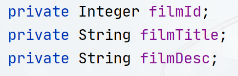

而在定义数据库模型的时候，一般情况下对数据库的字段名，没有强制规定，按需求来，因此可能你的数据库的字段名采用的是下划线命名法的方式：

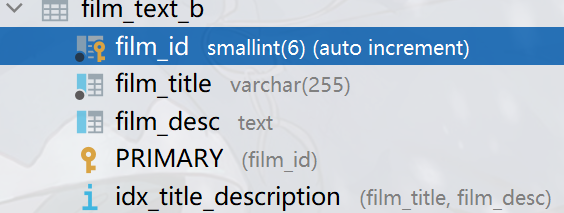

这个时候，如果我们的查询仍然使用类似于下面的`SQL`：

```sql
SELECT * FROM file_text_b
```

则会出现查询数据全是`NULL`的情况（日志里面能查询数据，但是数据无法映射上实体类！）

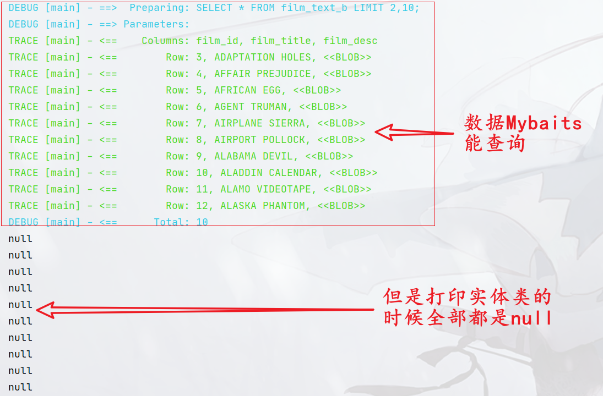

在一些更极端的表上，如：

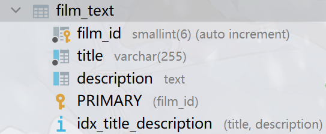

数据库表名字和实体类名字完全不一样，查询出来的也是同样的结果！

为了解决这一类问题，`ResultMap`应允而生！

### ResultMap标签

可以使用`ResultMap`标签解决上面的所有问题，在`Mapper`文件中定义`ResultMap`标签，标签的定义方式如下：

```xml
<resultMap id="填写的唯一id，一般使用实体类名字小写即可" type="对应实体类的全限定类名">
    <!-- 一般情况下只需要填写column属性和property属性即可 -->
    <id column="数据库中的列名称" property="javabean中的字段名称"
        jdbcType="JDBC类型" javaType="对应Java类型的全限定类名" typeHandler="类型转换器，具体参考typehandler章节"/>
    <result column="" property="" javaType="" jdbcType="" typeHandler=""/>
    <result column="" property="" javaType="" jdbcType="" typeHandler=""/>
</resultMap>
```

`ResultMap`标签有下面的属性：

- `id属性` ：必填，并且唯一。 `select`标签中的`resultMap`属性指定的值即为此处`id`所设置的值。
- `type属性` ：必填，用于配置查询列所映射到的`Java`对象类型的全限定类名。
- `extends属性`： 选填，可以配置当前的`resultMap`继承自其他的`resultMap`，属性值为

继承的`resultMap`的`id`

- `autoMapping属性`：选填，可选值为`true|false`，用于配置是否启用非映射字段（没

有在`resultMap`中配置的字段〉的自动映射功能，该配置可以覆盖全局的`autoMappingBehavior`配置。

`ResultMap`标签有下面的子标签：

- `constructor`配置使用构造方法注入结果，包含以下两个子标签：

  - `idArg`：`id`参数，标记结果作为`id`（唯一值），可以帮助提高整体性能，通常用于主键！

  - `arg`：注入到构造方法的一个普通结果。

- `id`：`id`参数，标记结果作为`id`（唯一值），可以帮助提高整体性能，通常用于主键！
  - `column属性`：数据库中的列名称
  - `property属性`：`javabean`中的对应字段名称
  - `jdbcType属性`：规定该字段采用什么`JDBC`类型存储到数据库，具体支持什么类型需要看具体的数据库和`JDBC`版本，常见的有这些：`ARRAY、BIGINT、BINARY、BIT、BLOB、BOOLEAN、CHAR、CLOB、CURSOR、DATALINK、DATE、DATETIMEOFFSET、DECIMAL、DISTINCT、DOUBLE、FLOAT、INTEGER、JAVA_OBJECT、LONGNVARCHAR、LONGVARBINARY、LONGVARCHAR、NCHAR、NCLOB、NULL、NUMERIC、NVARCHAR、OTHER、REAL、REF、ROWID、SMALLINT、SQLXML、STRUCT、TIME、TIME_WITH_TIMEZONE、TIMESTAMP、TIMESTAMP_WITH_TIMEZONE、TINYINT、UNDEFINED、VARBINARY、VARCHAR`
  - `javaType属性`：对应`Java`类型的全限定类名
  - `typeHandler属性`：用于处理`Java`类型到`JDBC`类型的存储方式，参考`TypeHandler`接口

- `result`：注入到`Java`对象属性的普通结果。
  - `column属性`：同`id`标签
  - `property属性`：同`id`标签
  - `jdbcType属性`：同`id`标签
  - `javaType属性`：同`id`标签
  - `typeHandler属性`：同`id`标签

- `association`：一个复杂的类型关联，许多结果将包成这种类型

- `collection`：复杂类型的集合。

- `discriminator`：根据结果值来决定使用哪个结果映射。实现类似于`switch...case...`效果

如果使用`id`、`result`标签组合，则是使用`Setter`方式创建`JavaBean`，如果使用`constructor`标签，则使用构造器方式创建`JavaBean`！

其中`association`、`collection`、`discriminator`这三个标签一般用于复杂查询，会在后面介绍！

一个`ResultMap`的编写例子可以参考下面：

```xml
<resultMap id="filmText" type="cn.argentoaskia.beans.FilmTextBean">
    <id property="filmId" column="film_id"/>
    <result property="filmTitle" column="title"/>
    <result property="filmDesc" column="description"/>
</resultMap>
```

无论是第一个问题还是第二个问题都可以使用`ResultMap`来解决！

### 解决前面的问题

问题`1`的解决方法比较多，因为他们只是命名风格不一样而已，在`Mybatis`上可以使用一个设置解决这个风格问题，总的来说可以使用下面三种方式：

- `ResultMap`方式
- `SQL`语句起别名方式
- `MapUnderscoreToCamelCase`设置为`true`

经过上述对`ResultMap`的介绍后，如何解决这个问题相信也有点眉目了，我们只需要在`Mapper`中定义一个`ResultMap`：

```xml
<resultMap id="fileText2" type="cn.argentoaskia.beans.FilmTextBean">
    <id property="filmId" column="film_id"/>
    <result property="filmTitle" column="film_title"/>
    <result property="filmDesc" column="film_desc"/>
</resultMap>
```

然后在对应的`Select`标签上，使用对应的`resultmap`属性引用上`id`：

```xml
<select id="selectAll3" resultMap="fileText2">
    SELECT * FROM film_text_b LIMIT 2,10;
</select>
```

即可解决问题！

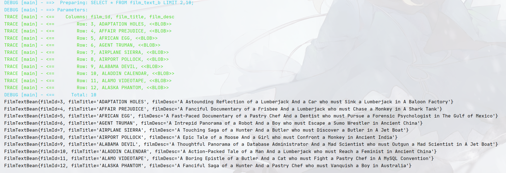

当然推荐大家使用`ResultMap`的方式，如果数据只是临时性的，实际上也可以采用`SQL`起别名的方式，因为`Mybatis`的映射规则是查询出来的二维表的表名（**注意不是数据库表的表名**）和`JavaBean`的字段名相同：

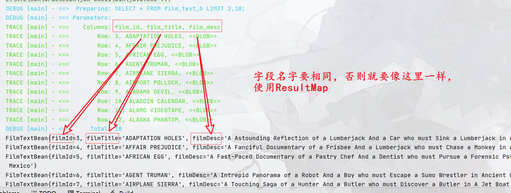

因此，另外一种解决方法是使用别名的方式：

```xml
<select id="selectAll3" resultType="cn.argentoaskia.beans.FilmTextBean">
    SELECT film_id AS filmId, film_title AS filmTitle, film_desc AS filmDesc
    FROM film_text_b
    LIMIT 2,10;
</select>
```

也可以解决！**上面两种方法问题1和问题2都能够解决！**

当然如果像问题1一样，只是命名的风格有问题的话，还可以设置`MapUnderscoreToCamelCase`设置为`true`解决！去`mybatis-config.xml`的`Settings`标签中添加`MapUnderscoreToCamelCase`并设置为`true`

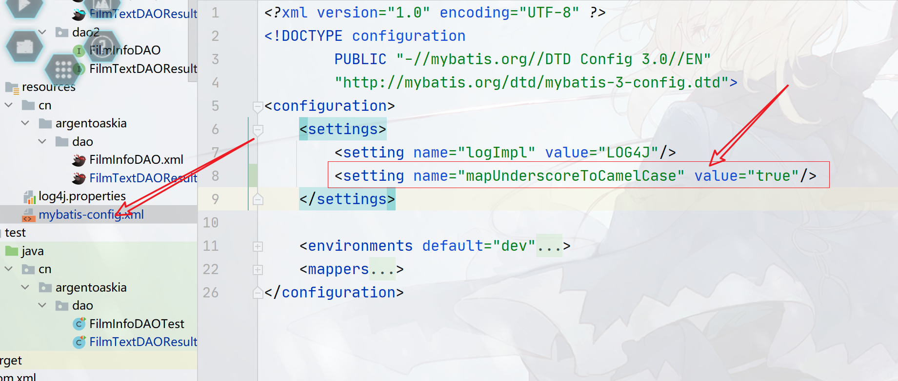

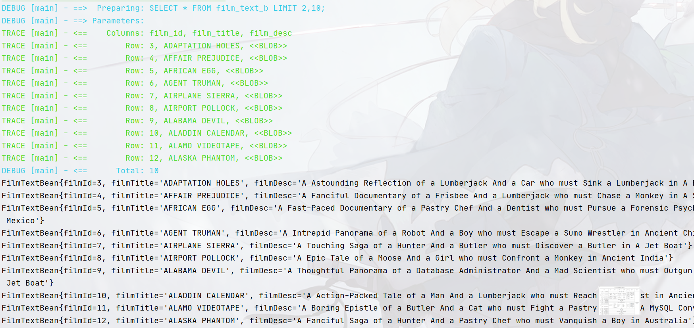

### ResultMap注解形式配置

可以参考`cn.argentoaskia.dao2.FilmTextDAOResultMap`接口的写法。

可以使用`@Results`注解来定义一个`ResultMap`：

```java
@Documented
@Retention(RetentionPolicy.RUNTIME)
@Target(ElementType.METHOD)
public @interface Results {
  // id对应ResultMap标签的id属性
  String id() default "";
  // Result类型对应ResultMap标签的id标签和Result标签
  Result[] value() default {};
}
```

其中`Result`类型是注解类型，其定义如下：

```java
@Documented
@Retention(RetentionPolicy.RUNTIME)
@Target(ElementType.METHOD)
@Repeatable(Results.class)
public @interface Result {
  // true则代表该Result采用的id标签
  boolean id() default false;
  // 查询出来的二维表的列名
  String column() default "";
  // JavaBean的字段名
  String property() default "";
  // javaType
  Class<?> javaType() default void.class;
  // JdbcType  
  JdbcType jdbcType() default JdbcType.UNDEFINED;
  // 指定TypeHandler  
  Class<? extends TypeHandler> typeHandler() default UnknownTypeHandler.class;

  // 后面两个在复合查询时用到！
  /**
   * Returns the mapping definition for single relationship.
   *
   * @return the mapping definition for single relationship
   */
  One one() default @One;

  /**
   * Returns the mapping definition for collection relationship.
   *
   * @return the mapping definition for collection relationship
   */
  Many many() default @Many;
}
```

你可以这样使用注解定义一个`ResultMap`：

```java
@Results(
        id = "filmText",
        value = {
                @Result(property = "filmId", column = "film_id", id = true),
                @Result(property = "filmTitle", column = "title"),
                @Result(property = "filmDesc", column = "description")
        }
)
@Select("SELECT film_id, title, description\n" +
        "        FROM film_text")
List<FilmTextBean> selectAll1();
```

注解形式的`ResultMap`也可以重用，需要使用`@ResultMap`注解，如：

```java
@Select("SELECT film_id, title, description\n" +
        "FROM film_text\n" +
        "WHERE film_id = #{filmId}")
@ResultMap("filmText")
FilmTextBean selectByFilmId(@Param("filmId") Integer filmId);
```

可以使用`@ResultType`指定返回类型来解决命名问题（相当于`select`标签的`resultType`属性）：

```java
@ResultType(FilmTextBean.class)
@Select(" SELECT film_id AS filmId, title AS filmTitle, description AS filmDesc\n" +
        "        FROM film_text")
List<FilmTextBean> selectAll2();
```

### ResultMap AutoMapping

现在我们有这个实体类：

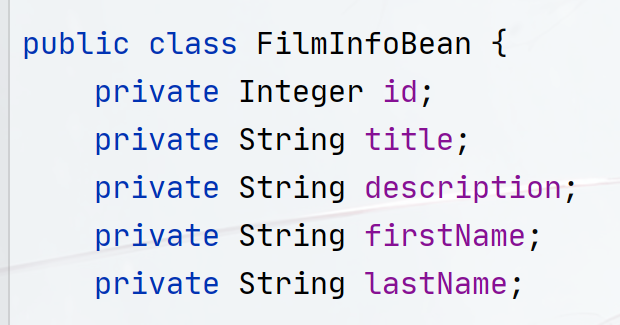

我们需要级联这三张表：

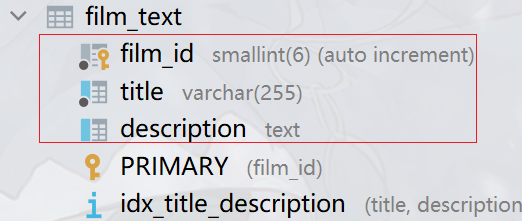

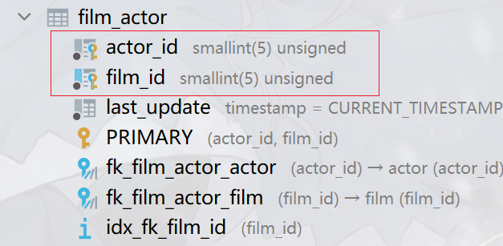

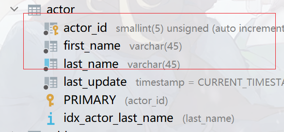

其中我们要查询出来的数据库字段有：

`film_id、title、description、first_name、last_name`

其中`title`字段和`description`字段实体类和查询出来的二维表相同，我们只需要更改另外三个，因此可以使用`autoMapping=true`来设置自动映射，ResultMap可以这样写：

```xml
<resultMap id="filmInfoBean" type="cn.argentoaskia.beans.FilmInfoBean"
autoMapping="true">
    <id column="film_id" property="id"/>
    <result column="first_name" property="firstName"/>
    <result column="last_name" property="lastName"/>
</resultMap>
```

`title`字段和`description`字段会自动映射，使用这种方式减少`resultmap`的重量！

### ResultMap Extends

`ResultMap`也支持继承关系，只需要指定`extends`属性填入需要被继承的`ResultMap`即可！

另外被继承的`ResultMap`支持跨Mapper文件填入，只需要填入类似于包名的写法即可，如：

```xml
<!-- 该ResultMap定义在：src/main/resources/cn/argentoaskia/dao/FilmInfoDAO.xml -->
<resultMap id="filmTextActor" type="cn.argentoaskia.beans.FilmTextActor"
extends="cn.argentoaskia.dao.FilmTextDAOResultMap.filmText">
    <result column="actor_id" property="actorId"/>
    <result column="first_name" property="firstName"/>
    <result column="last_name" property="lastName"/>
    <result column="last_update" property="lastUpdate"/>
</resultMap>
```

```xml
<!-- 该ResultMap定义在：src/main/resources/cn/argentoaskia/dao/FilmTextDAOResultMap.xml -->
<resultMap id="filmText" type="cn.argentoaskia.beans.FilmTextBean">
    <id property="filmId" column="film_id"/>
    <result property="filmTitle" column="title"/>
    <result property="filmDesc" column="description"/>
</resultMap>
```

注意上面的`extends="cn.argentoaskia.dao.FilmTextDAOResultMap.filmText"`，写法类似于包名一样即可！

