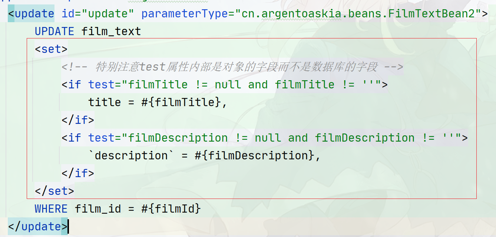
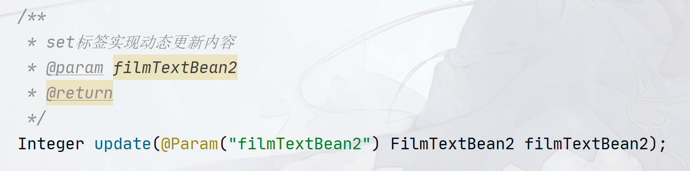
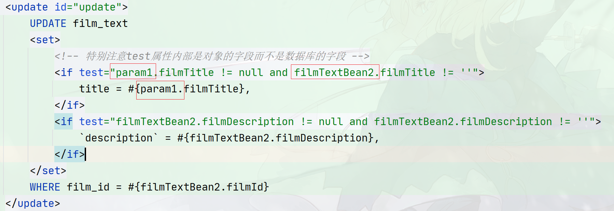
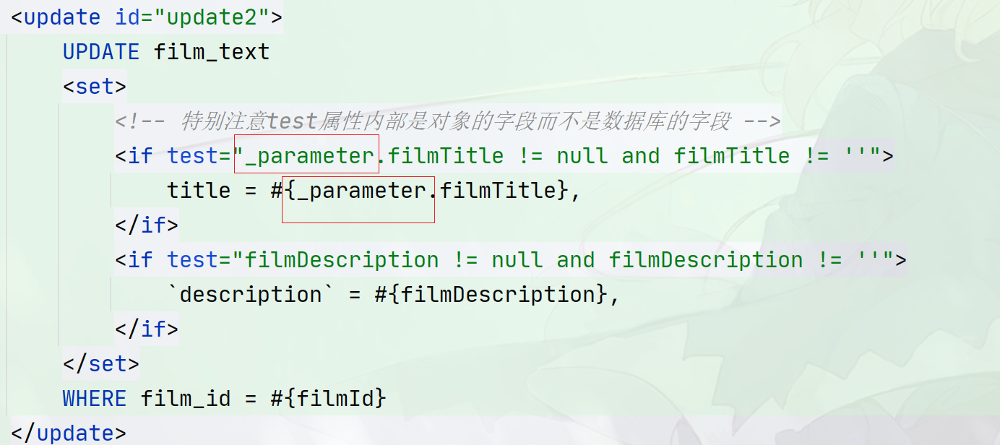
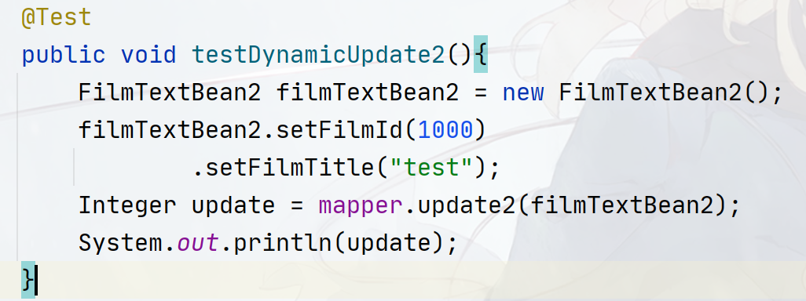
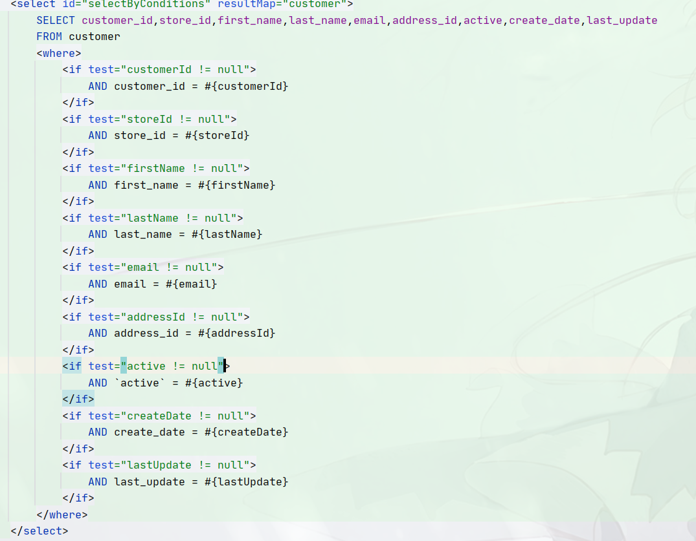
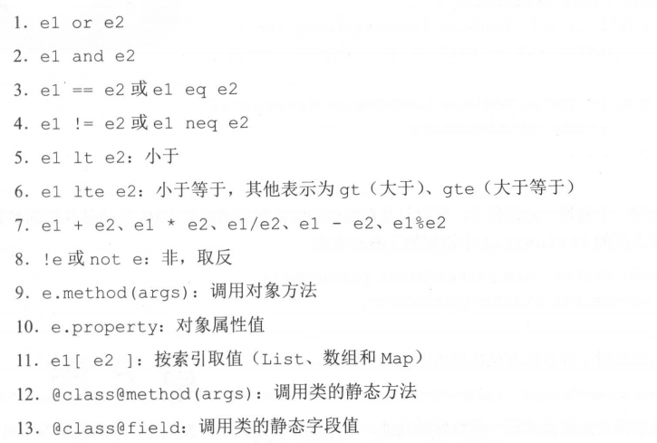
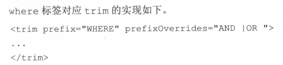
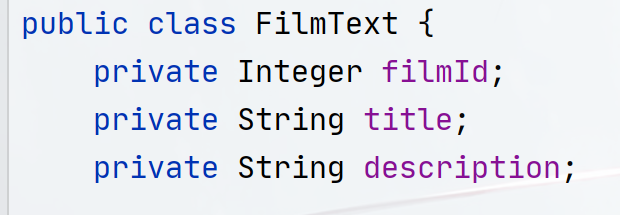

## 动态SQL

`mybatis`中一共有`7`个动态标签，他们分别是：

- `set`：相当于`SQL`语句中的`SET`
- `where`：相当于`SQL`语句中的`WHERE`
- `trim`：`set`、`where`的上一层实现，一般用于拼接左右连接和格式化字符用！
- `foreach`：用于迭代
- `if`：判断标签，需要在`test`属性里面写表达式
- `choose`：类似于实现`if...else...`的结构
- `bind`：用于绑定表达式

### Set标签

其中`set`标签一般用于解决表中字段的局部修改，在传统的`JDBC`的`Update`语句中，我们可以通过判断传递的对象是否是`null`来拼接`SQL`语句，但是在`mybatis`中很难做到这一点，因为`mapper`的`xml`是写死的！

为了解决这个问题，动态`SQL`出现了！

要想实现局部的修改，在`Mapper`中，需要这样使用`Set`标签：



`update`标签的`parameterType`可写可不写！

配置`if`标签使用即可，`if`标签中`test`属性写`OGNL`表达式，表达式的结果是`true`或者`false`。除此之外所有非`0`值都是`true`，只有`0`为`false`，其中：

- `filmTitle`属于`FilmTextBean2`类的字段，在`mybatis`中，如果`DAO`接口方法**只有一个参数**，则`OGNL`允许直接写**类的字段名**
- `filmTitle != null`一般可以用来判断一个对象是否是`null`，如果对象是`String`类型，则允许使用`filmTitle != ''`来判断是否为空！
- `OGNL`中使用`and、or`来代表逻辑于和或，连接两个表达式！

> 实际上，要想使用原本的**对象名.属性名**的方式来写参数，也是可以的，需要你给参数使用@Param起别名，起了别名之后，你就可以使用别名或者paramX形式来实现对象名.属性名的写法！
>
> 
>
> 
>
> 但是，为什么呢？为什么单个参数的时候能够直接引用类的字段名就能用来判断？mybatis怎么知道filmTitle会是FilmTextBean2的字段？
>
> 要想回答这个问题，实际上要考虑两个因素：
>
> - 单参数
>
> - 反射API中Parameter类的局限性
>
> 因为方法只有一个参数的情况下，`mybatis`默认会给参数生成一个`_parameter`标记，并且这个标记可以省略不写，因此实际上是这样的：
>
> 
>
> 并不是能够直接引用，而是因为参数只有一个，使用了_parameter标记来命名，并且这个标记可以省略不写！这也是mybatis知道filmTitle会是FilmTextBean2的字段的原因（1.没有其他参数、2.\_parameter标记）
>
> 那么现在的问题是为什么标记了@Param之后就有可以使用具体的名字.属性名了呢？
>
> 要知道反射里面有一个Parameter类专门代表方法的参数，换句话说当我们拿到一个Method对象之后，我们可以调用这个API来获取方法上的所有参数：
>
> ```java
> Method method = ...;
> Parameter[] parameters = method.getParameters();
> ```
>
> 然后通过`parameter`类的`getName()`来获取参数名，如：
>
> ```java
> String arg0 = parameters[0].getName()
> ```
>
> 神奇的事情就出在这个`getName()`，  根据[oracle官方解释](https://docs.oracle.com/javase/tutorial/reflect/member/methodparameterreflection.html) ， 编译器为了压缩`.class`大小，压缩了参数名，默认用`argN`（N代表方法参数列表下标），也就是说通过 `getName()`获取到的参数名是：arg0，arg1，arg2这些名称。
>
> 如果确实想要获取真正参数名，也不是没有办法，在`javac`命令后面加上`-parameters`参数即可，**但是这个方法仅限于类，接口不适用！**
>
> 这也就是为什么需要写@Param来标记参数的原因，归根揭底是因为无法获取具体的参数名，我们指定@Param之后，相当于变相给方法的参数起了个名字（只要名字和参数绑定在一块即可！）因此当然可以写这个名字+具体的属性名来定位参数的属性了！（也就是对应我们补充的那种写法）

回到这个图片，关注以下`if`内部的写法：


要特别注意每个if标签内部写表达式的时候都会保留`,`，即便是最后一个也不例外，这里就涉及到set标签的两大功能：

- **在生成的SQL语句前面加上SET关键字**
- **自动去掉最后的**`,`

我们假设传递的实体对象如下：



只需要修改`FilmTitle`字段，其他字段为`null`，则在刚刚的set标签体中，他会进行这样的操作：

1. 首先test所有的if，满足条件则拼接if标签体内容，不满足则丢弃内容，现在的sql变成了：

   ```sql
   -- 因为filmDescription为null，去掉filmDescription的if标签体内容
   UPDATE film_text
   title = #{_parameter.filmTitle},
   WHERE film_id = #{filmId}
   ```

2. 在生成的`SQL`语句前面加上`SET`关键字

   ```sql
   UPDATE film_text
   SET title = #{_parameter.filmTitle},
   WHERE film_id = #{filmId}
   ```

3. 自动去掉最后的`,`

   ```sql
   -- 现在就是完成的SQL啦！
   UPDATE film_text
   SET title = #{_parameter.filmTitle}
   WHERE film_id = #{filmId}
   ```


### Where标签

`where`标签和`set`标签类似，一般用于拼接`where`条件，他的核心也是：

- 在动态拼接的`SQL`语句前面加上WHERE关键字
- 去除开头的`AND`或者`OR`

写法参考：



### if标签

`if`标签的`test`是必填项目，填入`OGNL`表达式，返回的结果是一个`true`或者`false`的结果，如果是`true`则加入标签体的内容，否则不加入

```java
<if test="customerId != null">
    AND customer_id = #{customerId}
</if>
```

常见的`OGNL`表达式如下：



属性值单参数情况下能够省略参数标记`_parameter`，调用方法时尽量加上！

### trim标签

`trim`标签一般用来做格式化拼接，`where`和`set`标签的功能都可以用`trim`标签来实现，并且在底层通过`TrimSqlNode`实现的



该标签有四个属性：

- `prefix`：`trim`标签体内的内容会添加上该属性的内容作为前缀
- `prefixOverrides`：`trim`标签体内的内容如果以`prefixOverrides`的字符串开头，则去除该字符串。
- `suffix`：`trim`标签体内的内容会添加上该属性的内容作为后缀
- `suffixOverrides`：`trim`标签体内的内容如果以`suffixOverrides`的字符串结尾，则去除该字符串。

格式如下：

```xml
<trim prefix="SET" prefixOverrides="," suffix="OR" suffixOverrides="AND">
	,ABCDEDFHIJKLMN AND
</trim>
<!-- 生成的结果 -->
SETABCDEDFHIJKLMN OR
```

### foreach标签

`foreach`一般用于动态迭代，如迭代`IN`内部的成员、`INSERT`插入多个成员等，功能类似于`StringJoinner`。有下面这些参数：

- `collection`：指定用于迭代的参数，该参数一般是数组、List、Set、Map等，如果方法只有一个参数，可以使用`_parameter`标记，也可以使用默认值（参考下面），或者使用`@Param`注解命名：

```
  1.默认值如：argX（通用，X从0开始）、array（数组）、collection（集合类型）、list（列表）
  2.如果指定了@Param("name")，则可以使用：name作为名称，或者使用paramX，X代表数字，从1开始，特别注意指定了@Param("name")之后只有name名称和paramX可选，其他都是不可选的。
```

- `index`：代表下标，如果是数组、集合类型，则是下标，如果是`map`，则是`map`的`key`，填入变量名
- `item`：每次从数组、集合、`map`中获取值，`map`的话获取`value`值，填入变量名
- `open`：循环开始的拼接的开端（相当于`prefix`，左连接字符串）
- `close`：循环的结束的拼接结尾（相当于`suffix`，右连接字符串）
- `separator`：迭代元素与元素之间的连接符

格式：



```java
// DAO接口
int insertArray1(FilmText ...filmTexts);
```

```xml
<!-- mapper -->
<insert id="insertArray1">
    INSERT INTO film_text
    <foreach collection="array" index="i" item="filmText" open="VALUES"
             separator=",">
        (#{filmText.filmId}, #{filmText.title}, #{filmText.description})
    </foreach>
</insert>
```

### choose标签

choose只要实现类似于`if...else if... else...`结构，标签写法如下：

```html
<choose>
    <when test="条件">
       SQL内容
    </when>
    <when test="条件">
        SQL内容
    </when>
    <otherwise>
        SQL内容
    </otherwise>
</choose>
```

其中`when`可以有多个，`otherwise`最多只有一个，可以没有！`test`和`if`中的`test`一样！

