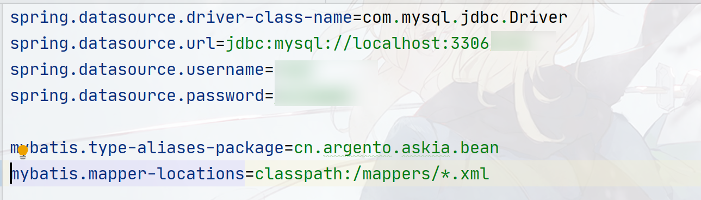
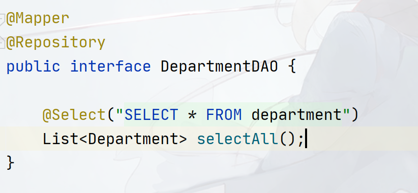

## SpringBoot整合Mybatis

`SpringBoot`整合`Mybatis`非常简单，`Mybatis`本身带了一个`@Mapper`注解，整合了之后`SpringBoot`会扫描带该注解的接口并绑定`Mapper`（如果有的话），创建代理类，我们需要引入这个包：

```xml
<dependency>
    <groupId>org.springframework.boot</groupId>
    <artifactId>spring-boot-starter-jdbc</artifactId>
    <version>2.7.1</version>
</dependency>
<dependency>
    <groupId>org.mybatis.spring.boot</groupId>
    <artifactId>mybatis-spring-boot-starter</artifactId>
    <version>2.2.2</version>
</dependency>
```

然后在`application.properties`里面指明`Mapper`的位置（支持`Ant`扫描）和`Datasource`



之后在`DAO`接口中上标记：`@Mapper`即可，根据习惯，一般也会加上`@Repository`



这样就整合完成了！
